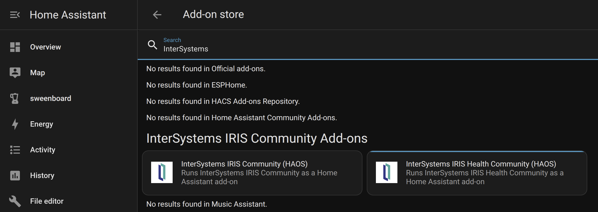
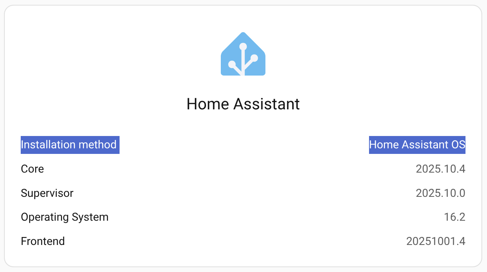
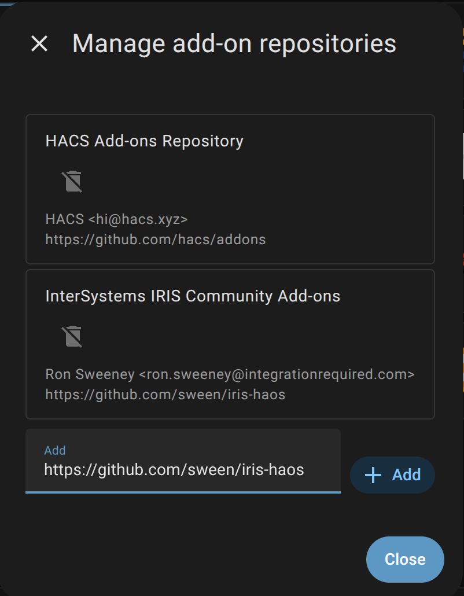
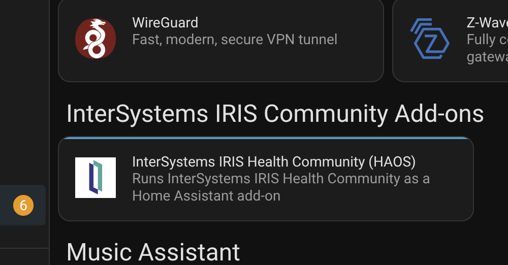
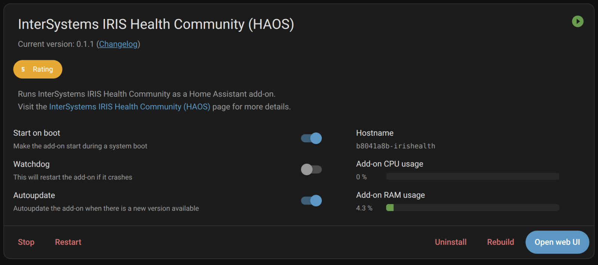
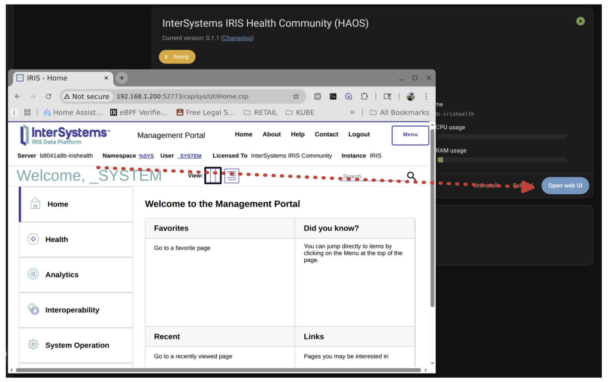
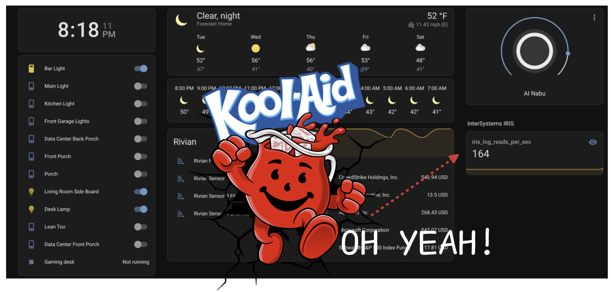

# 📦 iris-haos

> *InterSystems IRIS Add On(s) for Home Assistant.*



## 🌟 Highlights

- Instantly provision your IRIS Application to be launched from HAOS!
- Simple and Powerful

## ℹ️ Overview

We're Running HAOS, and we have checked the about box and confirmed our installation method to be "Home Assistant OS".




## ⬇️ Installation

For Home Assistant OS, follow these steps:

1. Add the repository to the Add On Store.
2. Restart the Supervisor.
3. Search for "InterSystems IRIS Community Add-ons" and install and start it.
4. Launch the System Management Portal.

Add Repository



Search for it in the store



Install and Start



Launch



## 📝 Extra Credit

Scrape a metric from IRIS and display it in HAOS.

Add the following to your `configuration.yaml`:

```yaml
sensor:
  - platform: rest
    name: iris_global_references_total
    resource: http://127.0.0.1:52773/api/monitor/metrics
    value_template: >
      {{ value.split('iris_global_references_total')[1].split('\n')[0].split()[-1] }}
```

for some reason, I had to:

```
ha core restart
```

Add new sensor to your dashboard:





## ✍️ Authors ( so far! )

Ron Sweeney, Integration Required
https://www.integrationrequired.com
https://github.com/sween

## 💭 Feedback and Contributing

I would really like to see some of the apps built for https://openexchange.intersystems.com included here, hit me up and lets see if we can add them.
